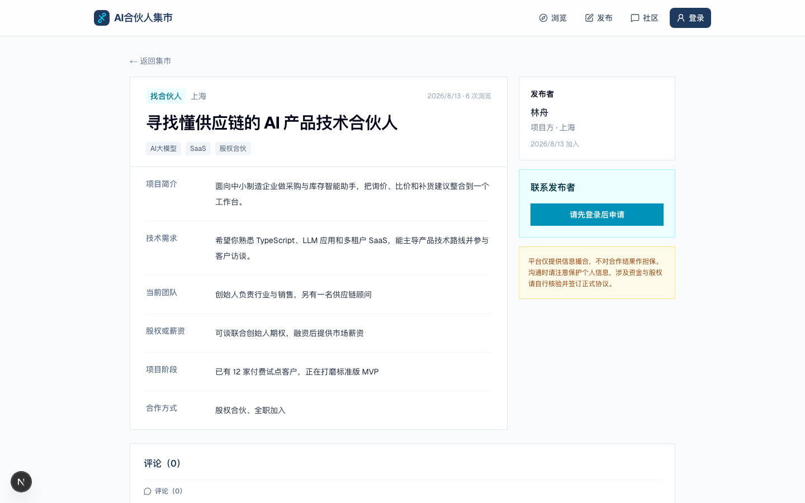
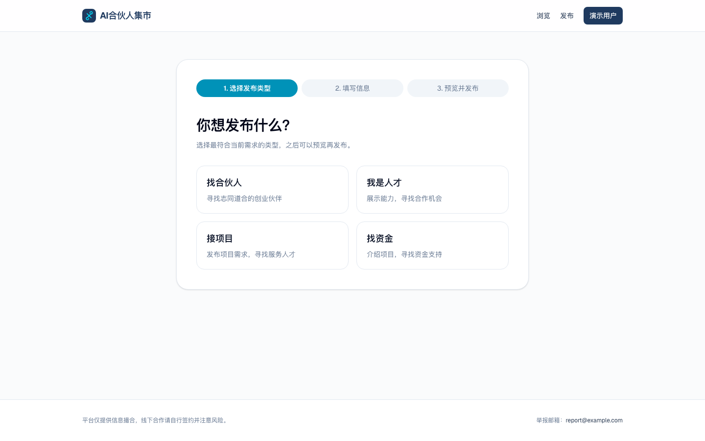
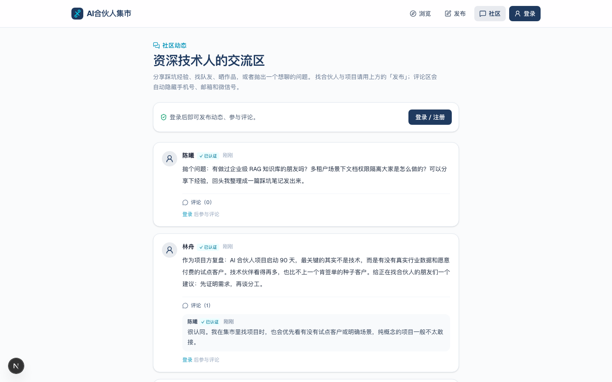
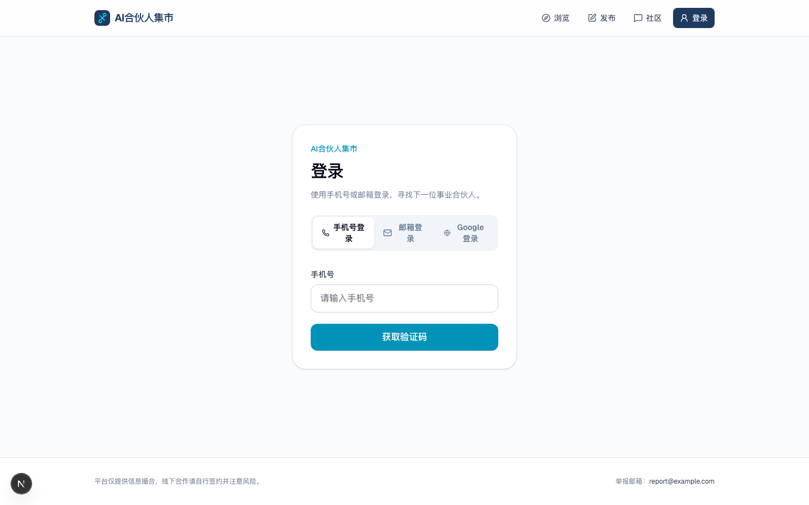

# AI合伙人集市（senior-fusion-platform）

国内面向资深技术人（35+ / 10 年+）的 AI 创业合伙信息集市 —— 极简发帖、个人直连、联系方式需申请解锁。

**一句话：** 让资深技术人与 AI 创业项目高效对接，平台只做信息撮合，不介入交易。

> 本仓库由两个原型合并升级而来：原 `senior-fusion-platform`（Next.js + Prisma 全栈 MVP）为底座，吸收了 `ai-partner-marketplace`（Vite 前端原型）的搜索、分类入口、排序、认证徽章与品牌视觉。

## Features

- 登录页三 tab：手机号 OTP（阿里云短信；本地可用 `SMS_DRY_RUN`）+ 邮箱魔法链接 + Google 账号登录（Supabase Auth，首次登录自动注册）
- 四类结构化帖子：找合伙人 / 我是人才 / 接项目 / 找资金
- 城市（北京/上海/深圳/广州/杭州/成都/西安/远程）、类型、标签筛选 + **关键词搜索** + **最新/热度排序** + **分页加载更多**
- 首页双面价值入口（资深专业人士 / 企业·投资人）+ 信任标识；导航选中高亮 + lucide 图标；右上角显示登录账号（手机号/邮箱）
- 帖子卡片按类型区分图标 + 发布者「已认证」徽章
- 联系方式申请解锁（作者同意后才可见）
- 发帖 AI 润色（采用 / 放弃；失败不影响发布）
- **AI 匹配推荐**：首页「为你推荐」即时渲染（只读缓存/规则评分，不等待 LLM）；推荐页 `/recommendations` 分页展示（每页 5 条、缓存 20 条），首屏秒出规则结果后在后台自动生成一次 LLM 理由（`sf_recommendations.llm` 标记），也可手动「刷新推荐」重新生成；30 分钟缓存、失败自动降级为规则文案；推荐帖详情页展示「AI 认为这条适合你」
- **社区动态区** `/community`（2026-08-18 修订）：动态发布/评论 + 帖子详情评论区；评论与动态写入时自动脱敏联系方式，每日频控，作者可删除
- 个人中心：我的帖子（隐藏/刷新）、解锁申请（收/发）、**技能方向与经验年限**
- 管理员手机号可软隐藏垃圾帖
- 品牌视觉：深蓝 `#1F3A5F` + 活力青 `#06B6D4`，专业极简商务风（lucide-react 图标）

**明确不做（v1）：** 微信登录/实名、站内私信、全文搜索（Elasticsearch）、付费置顶、小程序、App。
评论/社区已按 2026-08-18 设计修订纳入 v1.1（见设计文档修订节）。

## Stack

| Layer | Choice |
|-------|--------|
| App | Next.js 15 (App Router) + React 19 + TypeScript |
| UI | Tailwind CSS 4 + lucide-react 图标 |
| DB | **Supabase 托管 PostgreSQL** + supabase-js（service_role，REST，表统一 `sf_` 前缀） |
| Auth | Phone OTP + 邮箱魔法链接 + Google OAuth（Supabase Auth）；session token 存 **localStorage**，API 走 `Authorization: Bearer`（httpOnly cookie 仅作直连兜底，iframe 安全） |
| SMS | 阿里云短信（Dysmsapi） |
| LLM | OpenAI-compatible API（当前 DeepSeek） |
| Deploy | 阿里云 ECS/轻量 + Supabase（见 [deploy-aliyun.md](./docs/deploy-aliyun.md)） |

## Quick start

### Prerequisites

- Node.js 20+
- 一个 Supabase 项目（已建：`yggdfseoswfblvjewaov`）

### Setup

```bash
cp .env.example .env.local
# 填写 SUPABASE_DATABASE_URL（Supabase Dashboard → Connect → Connection string）
# 以及 OPENAI_COMPATIBLE_API_KEY / 短信相关变量

npm install
npm run seed                # 写入演示账号与帖子（幂等）
npm run dev
```

打开 [http://localhost:5600](http://localhost:5600)（平台端口方案：Step 6 → 56xx，见 `../platform/ports.config.json`）。`SMS_DRY_RUN=true` 时验证码打印在服务端日志中。

> 邮箱登录需要在 Supabase Dashboard → Auth → URL Configuration 把 `http://localhost:5600/**`
> 加入 Redirect URLs（本地开发），否则魔法链接会被 Supabase 拒绝跳转。

> Google 登录：在 Supabase Dashboard → Auth → Providers → Google 填入 OAuth Client ID / Secret，
> 并在 Google Cloud Console 的 OAuth Client（Web）里把
> `https://yggdfseoswfblvjewaov.supabase.co/auth/v1/callback` 加入 Authorized redirect URIs。

> 表结构（`sf_*`）与迁移 SQL 位于 `supabase/migrations/`，已通过 Supabase CLI 应用到
> `yggdfseoswfblvjewaov` 项目。改表后执行：
> `supabase db query --linked --file supabase/migrations/<file>.sql`（CLI 已登录时无需数据库密码）。

### Scripts

| Command | Description |
|---------|-------------|
| `npm run dev` | Dev server (Turbopack) |
| `npm run build` / `npm start` | Production build & serve |
| `npm test` | Vitest unit/route tests |
| `npm run lint` | ESLint |
| `npm run seed` | Seed demo users + posts + community posts |

## Environment

见 `.env.example`。关键变量：

| Variable | Purpose |
|----------|---------|
| `SUPABASE_SERVICE_ROLE_KEY` | 服务端数据访问（supabase-js），禁止下发到浏览器 |
| `NEXT_PUBLIC_SUPABASE_URL` / `ANON_KEY` / `PUBLISHABLE_KEY` | 项目标识，供未来客户端功能使用 |
| `OPENAI_COMPATIBLE_*` | AI 润色端点 / key / model |
| `SMS_*` | 阿里云短信；`SMS_DRY_RUN=true` for local |
| `ADMIN_PHONES` | Comma-separated admin mobile numbers |

Never commit `.env` / `.env.local`（两者均已 gitignore）。

## Project layout

```
src/app/           # Routes & API (App Router)
src/components/    # UI（SiteHeader / FilterBar / PostCard / CommunityComposer / CommentList …）
src/lib/           # Auth, posts, unlock, AI helpers + data 数据访问层（supabase-js）
src/tests/         # Vitest
supabase/          # 迁移 SQL（sf_ 前缀）+ CLI 链接配置
scripts/seed.ts    # 幂等种子脚本
docs/              # Specs, plans, research, deploy guide
```

## 同类产品调研（2026-08）

**GitHub 开源参考**

| 项目 | 可借鉴点 |
|------|----------|
| [openhr-founder-ai](https://github.com/ArjunFrancis/openhr-founder-ai) | 技能标签匹配、AI 兼容度评分、画像摘要、匹配理由解释 |
| [hackmate-rework](https://github.com/dfordp/hackmate-rework) | 滑动发现、双向意向才可见、技能画像 |
| [indexed-ideas](https://github.com/tmoxter/indexed-ideas) | 用语义相似度连接做同一问题的创始人 |
| [hasgeek/hasjob](https://github.com/hasgeek/hasjob) / [cncf/gitjobs](https://github.com/cncf/gitjobs) | 标签筛选、内容审核、开发者向信息板交互 |

**中国市场同类**

| 产品 | 参考点 |
|------|--------|
| 缘创派 | 按人/项目搜索合伙人，技术与投资人社区 |
| 爱合伙 | 100 万+ 创业者双向对接，AI 匹配在路上 |
| 程序员客栈 | 中高端程序员接单/组队，项目经理拆单、12 小时启动 |
| OPC 接单吧 / WeOPC | “一人公司”撮合，按行业场景分订单类型 |

**已吸收：** 关键词搜索、城市/类型/标签筛选、排序、分页、认证徽章、技能/年限画像、社区动态与评论。
**暂缓（需外部资源或设计确认）：** 双向意向、语义搜索、站内私信、微信登录。

## 关于 Python/FastAPI

暂不引入。当前规模下 Next.js API Routes + supabase-js 数据层已覆盖全部业务（OTP、会话、帖子、解锁、AI 润色、社区动态与评论）；引入 FastAPI 会拆分部署与鉴权，得不偿失。若后续需要重计算（简历解析、向量检索、批量评测），再以独立服务方式接入。

## Docs

| Doc | What |
|-----|------|
| [AGENTS.md](./AGENTS.md) | Guidance for coding agents |
| [Merged features](./docs/codex_merged_features.md) | 双项目合并说明（功能对照与取舍） |
| [Design spec](./docs/superpowers/specs/2026-07-21-ai-partner-marketplace-design.md) | Product decisions (source of truth) |
| [Aliyun deploy](./docs/deploy-aliyun.md) | ECS/Nginx/PM2 + Supabase 迁移 |
| `docs/kimi-*.md`, `docs/doubao-*.md`, … | Research / earlier PRD drafts |

## Success bar (post-launch)

- ~50+ real posts with senior-quality signal
- ≥10 approved contact unlocks in 4–6 weeks

## License

Private project (`package.json` `"private": true`).

<!-- screenshots -->
## Screenshots

| Home | Post Detail | Publish |
| --- | --- | --- |
|  |  |  |

| Community | Login |
| --- | --- |
|  |  |

<!-- /screenshots -->
