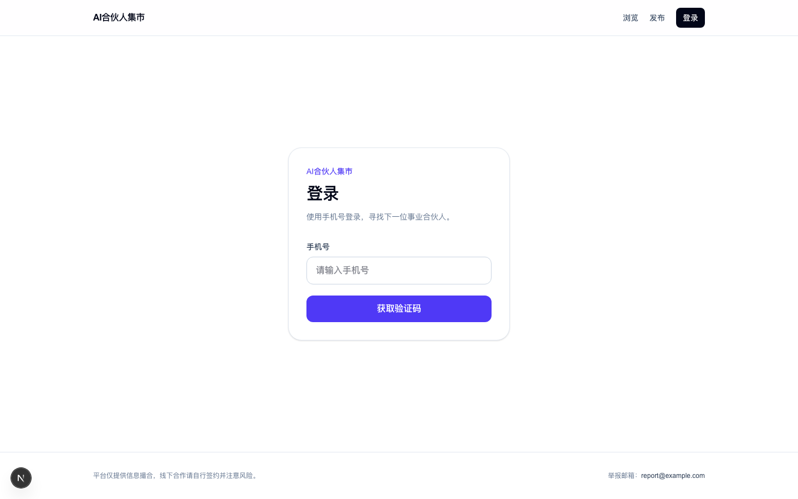

# AI合伙人集市

国内面向资深技术人的 AI 创业合伙信息集市 — Craigslist 风格极简发帖、个人直连、联系方式需申请解锁。

**一句话：** 让 35+/10 年+ 技术人与 AI 创业项目高效对接，平台只做信息撮合，不介入交易。

## Features (v1)

- 手机号 OTP 登录（阿里云短信；本地可用 `SMS_DRY_RUN`）
- 四类结构化帖子：找合伙人 / 我是人才 / 接项目 / 找资金
- 城市、类型、标签筛选
- 联系方式申请解锁（作者同意后才可见）
- 发帖 AI 润色（采用 / 放弃；失败不影响发布）
- 个人中心：我的帖子、解锁申请、隐藏/刷新帖子
- 管理员手机号可软隐藏垃圾帖

**明确不做（v1）：** 微信登录/实名、站内私信、评论、全文搜索、付费置顶、小程序、App。

## Stack

| Layer | Choice |
|-------|--------|
| App | Next.js 15 (App Router) + React 19 + TypeScript |
| UI | Tailwind CSS |
| DB | PostgreSQL + Prisma |
| Auth | Phone OTP + httpOnly session cookie |
| SMS | 阿里云短信（Dysmsapi） |
| LLM | OpenAI-compatible API（默认通义兼容端点） |
| Deploy | 阿里云 ECS/轻量 + RDS（见下方） |

## Quick start

### Prerequisites

- Node.js 20+
- PostgreSQL 14+（本地或 RDS）

### Setup

```bash
cp .env.example .env
# Edit DATABASE_URL and other vars

npm install
npx prisma migrate dev
npx prisma db seed   # optional demo posts
npm run dev
```

Open [http://localhost:3000](http://localhost:3000).

With `SMS_DRY_RUN=true`, OTP codes are printed to the server log instead of being sent by SMS.

### Scripts

| Command | Description |
|---------|-------------|
| `npm run dev` | Dev server (Turbopack) |
| `npm run build` / `npm start` | Production build & serve |
| `npm test` | Vitest unit/route tests |
| `npm run lint` | ESLint |
| `npx prisma db seed` | Seed demo users + posts |

## Environment

See `.env.example`:

| Variable | Purpose |
|----------|---------|
| `DATABASE_URL` | PostgreSQL connection string |
| `SMS_*` | 阿里云短信；`SMS_DRY_RUN=true` for local |
| `LLM_*` | Polish API key / base URL / model |
| `ADMIN_PHONES` | Comma-separated admin mobile numbers |

Never commit `.env`. Production must set `SMS_DRY_RUN=false` and use real SMS credentials.

## Project layout

```
src/app/           # Routes & API (App Router)
src/components/    # UI
src/lib/           # Auth, posts, unlock, AI helpers
src/tests/         # Vitest
prisma/            # Schema + seed
docs/              # Specs, plans, research, deploy guide
```

## Docs

| Doc | What |
|-----|------|
| [AGENTS.md](./AGENTS.md) | Guidance for coding agents |
| [Design spec](./docs/superpowers/specs/2026-07-21-ai-partner-marketplace-design.md) | Product decisions (source of truth) |
| [Implementation plan](./docs/superpowers/plans/2026-07-21-ai-partner-marketplace.md) | Build plan |
| [Aliyun deploy](./docs/deploy-aliyun.md) | ECS/RDS/Nginx/PM2 + launch checklist |
| `docs/kimi-*.md`, `docs/doubao-*.md`, … | Research / earlier PRD drafts |

Where the design spec conflicts with older PRDs in `docs/`, **the design spec wins**.

## Success bar (post-launch)

- ~50+ real posts with senior-quality signal
- ≥10 approved contact unlocks in 4–6 weeks

## License

Private project (`package.json` `"private": true`).

<!-- screenshots -->
## Screenshots

| 首页 |
| --- |
|  |

<!-- /screenshots -->
